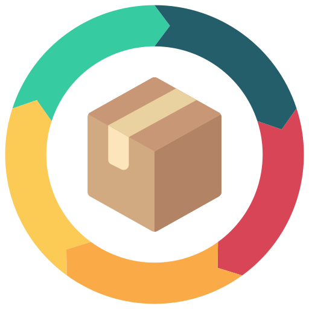

<!-- PROJECT LOGO -->
 

  

    
  

  <h3 align="center">Ekart Microservices</h3>

  

    Introducing Ekart : A Complete Solo Microservices Project

<!-- ABOUT THE PROJECT -->
## About The Project
![product-screenshot]
Ekart is an innovative microservices project that transforms the world of online shopping. Our platform comprises four core services:

- Stock Services
- Order Services
- Payment Services
- Frontend Services
- User Service

## Demo Of Project
### Kafka User Journey Track And Certificate Generation

  

## Our Standouts

- **Event Streaming**: The intergation of Kafka with my project ensures the realtime recording and processing of user's session activity (interactions-clicks-movement to different webpages)
- **PDF Generation**: Using Itext and OpenPdf our project generates a very sophisticated and elegant user-interaction-journey with the website for that particular session which was received by the kafka consumer.
- **Okta Security**: Okta facilitates our project with industry standard security parameters ranging from user authorization, user authentication etc.
- **Fault Tolerance (Resilience4j)**: The Cloud gateway not only load balances but also incorporates a Circuit Breaker which multiplies reliability and error handling.
- **Service Discovery**: Eureka ensures smooth service discovery.
- **Centralized Configurations**: Config Server pulling from my github repo centralizes configurations.
- **Traceability**: Docker and Zipkin Sleuth enhance traceability.
- **Communication**: RestTemplate, OpenFeign & WebClient in Cloud Gateway (since gateway is a WebFlux/Spring Reactive Web service) handle communication between services, making Ekart a comprehensive solution for modern commerce.
## Built With

Our project's core lies in **Maven Spring Boot** and the FrontEnd is built on vanilla **HTML, CSS & JavaScript.** And the communication between the services is provided by Apache Kafka.

* ![SpringBoot]
* ![JavaScript]
* ![Okta]
* ![Apache]
* ![Openpdf]
* ![MySql]  

## Microservices Architecture

We've adopted a "Database per Service" architecture to provide autonomy and scalability. Microservices are being adopted widely since they offer scalability, flexibility, and the ability to develop and deploy software components independently, which accelerates innovation and agility in modern software development.

- **Stock Services:**
Stock Services is responsible for managing the inventory of products available in your Ekart application. They keep track of product quantities, availability, pricing, and related information. Stock Services help ensure that customers can view and purchase products that are in stock.

- **Order Services:**
Order Services handle the process of placing and managing customer orders. They facilitate the addition of carts, order processing, order confirmation and display. The order is created only when its added to cart; and completed when payment is successful. Order Services ensure that customer orders are accurately recorded and processed.

- **Payment Services:**
Payment Services are responsible for handling payment processing within your Ekart application. The payment is initiated only when the order is created. Payment Services help ensure smooth and secure payment experiences for customers.

- **Frontend Services:**
Frontend Services represent the user interface and presentation layer of your Ekart application. They include web pages, zappy animation and interactive dropdown elements that customers use to browse products and place orders because memorizing stockId and orderId is arduous. Frontend Services are also acting as **Kafka producers** which is responsible for recording and registering the user movement in the website.

- **User Service:**
User Service focuses on managing user accounts and session info's. It acts as the **Kafka Consumer** which handles the info from Frontend Service and displays the journey of a user in his session via a pretty schematic downloadable PDF.

#### Salient Microservices

-  **Cloud API Gateway (SpringGateway)**
This handles the efficient routing of requests between services, ensuring smooth communication. The **Circuit Breaker** in it also provides a layer of Fault Tolerance. **Okta Security** integrated in this service is responsible for providing ndustry-standard security
-  **Eureka Service Registry**
Our Service Discovery facilitates automatic service registration, discovery, and load balancing, ensuring scalability and fault tolerance in our microservices architecture.
-  **Config Server**
Our Config Server centralizes and manages configuration settings, supporting dynamic updates without service redeployment.

Ekart is not just about convenience; it's also about ensuring the utmost security, scalability, and fault tolerance. With Cloud API Gateway, circuit breakers, Okta integration, and a modern tech stack, we provide an unparalleled shopping experience.

(<a href="#readme-top">back to top</a>)

<!-- CONTACT -->
## Contact

Developed By - [Prakarsh Srivastava](https://www.linkedin.com/in/prakarsh2101/) - prakarsh2101@gmail.com

Project Link: [Ekart-Microservice](https://github.com/prakarshs/Ekart-Microservice)

<!-- MARKDOWN LINKS & IMAGES -->
<!-- https://www.markdownguide.org/basic-syntax/#reference-style-links -->
[contributors-shield]: https://img.shields.io/github/contributors/othneildrew/Best-README-Template.svg?style=for-the-badge
[contributors-url]: https://github.com/othneildrew/Best-README-Template/graphs/contributors
[forks-shield]: https://img.shields.io/github/forks/othneildrew/Best-README-Template.svg?style=for-the-badge
[forks-url]: https://github.com/othneildrew/Best-README-Template/network/members
[stars-shield]: https://img.shields.io/github/stars/othneildrew/Best-README-Template.svg?style=for-the-badge
[stars-url]: https://github.com/othneildrew/Best-README-Template/stargazers
[issues-shield]: https://img.shields.io/github/issues/othneildrew/Best-README-Template.svg?style=for-the-badge
[issues-url]: https://github.com/othneildrew/Best-README-Template/issues
[license-shield]: https://img.shields.io/github/license/othneildrew/Best-README-Template.svg?style=for-the-badge
[license-url]: https://github.com/othneildrew/Best-README-Template/blob/master/LICENSE.txt
[linkedin-shield]: https://img.shields.io/badge/-LinkedIn-black.svg?style=for-the-badge&logo=linkedin&colorB=555
[product-screenshot]: images/demo.gif
[SpringBoot]: https://img.shields.io/badge/SpringBoot-32CD32?style=for-the-badge&logo=springBoot&logoColor=white
[JavaScript]: https://img.shields.io/badge/JavaScript-FFEA00?style=for-the-badge&logo=javaScript&logoColor=black
[Docker]: https://img.shields.io/badge/Docker-0096FF?style=for-the-badge&logo=docker&logoColor=white
[Apache]: https://img.shields.io/badge/Apache%20Kafka-DE3163?style=for-the-badge&logo=apache&logoColor=white
[Openpdf]: https://img.shields.io/badge/OpenPDF-F3F2ED?style=for-the-badge&logo=adobe&logoColor=DE3163
[MySql]: https://img.shields.io/badge/MySql-F28C28?style=for-the-badge&logo=mysql&logoColor=white
[Next.js]: https://img.shields.io/badge/next.js-000000?style=for-the-badge&logo=nextdotjs&logoColor=white
[Next-url]: https://nextjs.org/
[React.js]: https://img.shields.io/badge/React-20232A?style=for-the-badge&logo=react&logoColor=61DAFB
[React-url]: https://reactjs.org/
[Vue.js]: https://img.shields.io/badge/Vue.js-35495E?style=for-the-badge&logo=vuedotjs&logoColor=4FC08D
[Vue-url]: https://vuejs.org/
[Okta]: https://img.shields.io/badge/OKTA-00008b?style=for-the-badge&logo=okta&logoColor=white
[Angular.io]: https://img.shields.io/badge/Angular-DD0031?style=for-the-badge&logo=angular&logoColor=white
[Angular-url]: https://angular.io/
[Svelte.dev]: https://img.shields.io/badge/Svelte-4A4A55?style=for-the-badge&logo=svelte&logoColor=FF3E00
[Svelte-url]: https://svelte.dev/
[Laravel.com]: https://img.shields.io/badge/Laravel-FF2D20?style=for-the-badge&logo=laravel&logoColor=white
[Laravel-url]: https://laravel.com
[Bootstrap.com]: https://img.shields.io/badge/Bootstrap-563D7C?style=for-the-badge&logo=bootstrap&logoColor=white
[Bootstrap-url]: https://getbootstrap.com
[JQuery.com]: https://img.shields.io/badge/jQuery-0769AD?style=for-the-badge&logo=jquery&logoColor=white
[JQuery-url]: https://jquery.com 
